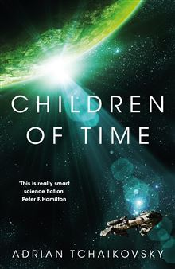

# "Children of Time (Children of Time, #1)"

By Adrian Tchaikovsky

## Book data

[GoodReads ID/URL](https://www.goodreads.com/book/show/25499718)

- ISBN: 1447273281
- ISBN13: 9781447273288
- Rating: 5
- Average Rating: 4.29
- Published: 2015
- Publisher: PanMacmillan
- Binding: Hardcover
- Shelves: science-fiction
- Shelf: read
- Pages: 600

## Review

“Children Of Time” by Adrian Tchaikovsky, recipient of the Arthur C. Clarke Award for best science fiction of the year in 2016, is the best new science fiction novel I have read in many years.

