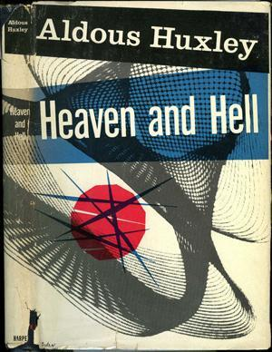

# Heaven and Hell

By Aldous Huxley

## Book data

[GoodReads ID/URL](https://www.goodreads.com/book/show/64284)

- ISBN: 0060802197
- ISBN13: 9780060802196
- Rating: 5
- Average Rating: 3.53
- Published: 1956
- Publisher: Harper Collins
- Binding: Hardcover
- Shelves: literature, essays, huxley
- Shelf: read
- Pages: 80

## See also

- [Antic Hay](Antic_Hay.md)
- [Ape and Essence](Ape_and_Essence.md)
- [Brave New World](Brave_New_World.md)
- [Crome Yellow](Crome_Yellow.md)
- [Island](Island.md)
- [Point Counter Point](Point_Counter_Point.md)
- [The Doors of Perception / Heaven and Hell](The_Doors_of_Perception_-_Heaven_and_Hell.md)
- [The Doors of Perception](The_Doors_of_Perception.md)
- [The Genius and The Goddess](The_Genius_and_The_Goddess.md)
