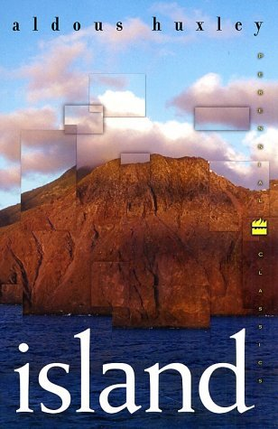

# Island

By Aldous Huxley

## Book data

[GoodReads ID/URL](https://www.goodreads.com/book/show/5130)

- ISBN: 0060085495
- ISBN13: 9780060085490
- Rating: 5
- Average Rating: 3.86
- Published: 1962
- Publisher: Harper Perennial Classics
- Binding: Paperback
- Shelves: literature, science-fiction, novels, huxley, fiction
- Shelf: read
- Pages: 354

## See also

- [Antic Hay](Antic_Hay.md)
- [Ape and Essence](Ape_and_Essence.md)
- [Brave New World](Brave_New_World.md)
- [Crome Yellow](Crome_Yellow.md)
- [Heaven and Hell](Heaven_and_Hell.md)
- [Point Counter Point](Point_Counter_Point.md)
- [The Doors of Perception / Heaven and Hell](The_Doors_of_Perception_-_Heaven_and_Hell.md)
- [The Doors of Perception](The_Doors_of_Perception.md)
- [The Genius and The Goddess](The_Genius_and_The_Goddess.md)
