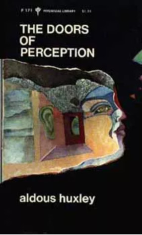

# The Doors of Perception

By Aldous Huxley

## Book data

[GoodReads ID/URL](https://www.goodreads.com/book/show/3372279)

- ISBN: 0060801719
- ISBN13: 9780060801717
- Rating: 5
- Average Rating: 3.92
- Published: 1954
- Publisher: HarperCollins Publishers
- Binding: Paperback
- Shelves: essays, nonfiction, philosophy, science, huxley
- Shelf: read
- Pages: 79

## See also

- [Antic Hay](Antic_Hay.md)
- [Ape and Essence](Ape_and_Essence.md)
- [Brave New World](Brave_New_World.md)
- [Crome Yellow](Crome_Yellow.md)
- [Heaven and Hell](Heaven_and_Hell.md)
- [Island](Island.md)
- [Point Counter Point](Point_Counter_Point.md)
- [The Doors of Perception / Heaven and Hell](The_Doors_of_Perception_-_Heaven_and_Hell.md)
- [The Genius and The Goddess](The_Genius_and_The_Goddess.md)
