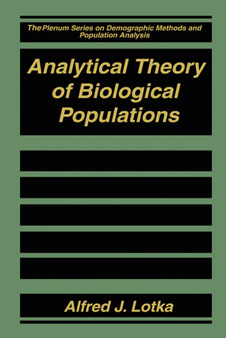

# Analytical Theory of Biological Populations

By Alfred J. Lotka

## Book data

[GoodReads ID/URL](https://www.goodreads.com/book/show/1957444)

- ISBN: 0306459272
- ISBN13: 9780306459276
- Rating: 0
- Average Rating: 3.00
- Published: 1998
- Publisher: Springer
- Binding: Hardcover
- Shelves: to-read
- Shelf: to-read
- Pages: 220

## See also

- [Elements of Mathematical Biology](Elements_of_Mathematical_Biology.md)
