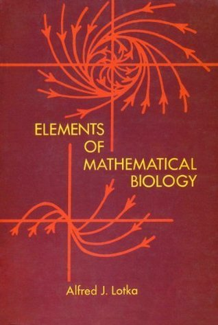

# Elements of Mathematical Biology

By Alfred J. Lotka

## Book data

[GoodReads ID/URL](https://www.goodreads.com/book/show/1985180)

- ISBN: 0486603466
- ISBN13: 9780486603469
- Rating: 5
- Average Rating: 4.67
- Published: 1956
- Publisher: Dover Publications
- Binding: Paperback
- Shelves: mathematics, science
- Shelf: read
- Pages: 465

## See also

- [Analytical Theory of Biological Populations](Analytical_Theory_of_Biological_Populations.md)
