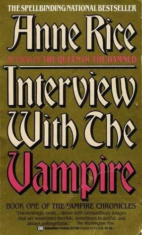

# "Interview with the Vampire (The Vampire Chronicles, #1)"

By Anne Rice

## Book data

[GoodReads ID/URL](https://www.goodreads.com/book/show/43763)

- ISBN: 0345476875
- ISBN13: 9780345476876
- Rating: 5
- Average Rating: 4.01
- Published: 1976
- Publisher: Ballantine Books
- Binding: Paperback
- Shelves: literature, novels, fiction
- Shelf: read
- Pages: 346

## See also

- ["The Queen of the Damned (The Vampire Chronicles, #3)"](The_Queen_of_the_Damned_The_Vampire_Chronicles__3.md)
- ["The Tale of the Body Thief (The Vampire Chronicles, #4)"](The_Tale_of_the_Body_Thief_The_Vampire_Chronicles__4.md)
- ["The Vampire Lestat (The Vampire Chronicles, #2)"](The_Vampire_Lestat_The_Vampire_Chronicles__2.md)
- ["The Witching Hour (Lives of the Mayfair Witches, #1)"](The_Witching_Hour_Lives_of_the_Mayfair_Witches__1.md)
