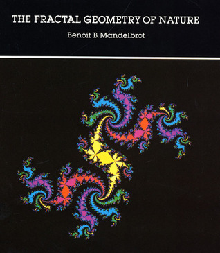

# The Fractal Geometry of Nature

By Benoît B. Mandelbrot

## Book data

[GoodReads ID/URL](https://www.goodreads.com/book/show/558059)

- ISBN: 0716711869
- ISBN13: 9780716711865
- Rating: 5
- Average Rating: 4.22
- Published: 1977
- Publisher: Times Books
- Binding: Hardcover
- Shelves: 
- Shelf: read
- Pages: 480

