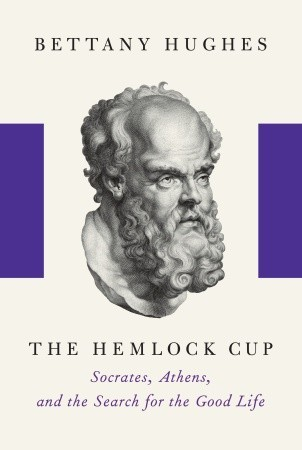

# "The Hemlock Cup: Socrates, Athens and the Search for the Good Life"

By Bettany Hughes

## Book data

[GoodReads ID/URL](https://www.goodreads.com/book/show/8461105)

- ISBN: 1400041791
- ISBN13: 9781400041794
- Rating: 4
- Average Rating: 3.98
- Published: 2010
- Publisher: Alfred a Knopf Inc
- Binding: Hardcover
- Shelves: biography, philosophy
- Shelf: read
- Pages: 484

