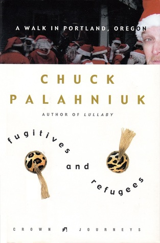

# "Fugitives and Refugees: A Walk in Portland, Oregon"

By Chuck Palahniuk

## Book data

[GoodReads ID/URL](https://www.goodreads.com/book/show/22289)

- ISBN: 1400047838
- ISBN13: 9781400047833
- Rating: 5
- Average Rating: 3.51
- Published: 2003
- Publisher: Crown Journeys/Crown Publishers/Crown Publishing Group/Random House
- Binding: Hardcover
- Shelves: nonfiction, biography
- Shelf: read
- Pages: 176

## See also

- [Beautiful You](Beautiful_You.md)
- [Make Something Up](Make_Something_Up-_Stories_You_Cant_Unread.md)
- [Rant](Rant.md)
- [Snuff](Snuff.md)
- [Survivor](Survivor.md)
- [Tell-All](Tell-All.md)
