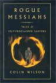

# Rogue Messiahs: Tales of Self-Proclaimed Saviors

By Colin Wilson

## Book data

[GoodReads ID/URL](https://www.goodreads.com/book/show/36029)

- ISBN: 1571741755
- ISBN13: 9781571741752
- Rating: 4
- Average Rating: 3.56
- Published: 2000
- Publisher: Hampton Roads Publishing Company
- Binding: Hardcover
- Shelves: nonfiction, biography, essays
- Shelf: read
- Pages: 274

## See also

- [Poetry and Mysticism](Poetry_and_Mysticism.md)
- [Sex Diary of a Metaphysician](Sex_Diary_of_a_Metaphysician.md)
- [Space Vampires](Space_Vampires.md)
- [The God of the Labyrinth](The_God_of_the_Labyrinth.md)
- [The Outsider](The_Outsider.md)
- [The Philosopher Stone](The_Philosopher_Stone.md)
