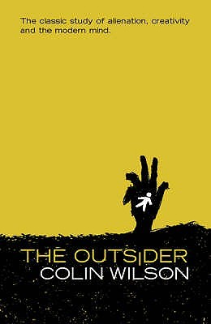

# The Outsider

By Colin Wilson

## Book data

[GoodReads ID/URL](https://www.goodreads.com/book/show/67880)

- ISBN: 0753814323
- ISBN13: 9780753814321
- Rating: 0
- Average Rating: 4.04
- Published: 1956
- Publisher: Phoenix
- Binding: Paperback
- Shelves: philosophy
- Shelf: read
- Pages: 322

## See also

- [Poetry and Mysticism](Poetry_and_Mysticism.md)
- [Rogue Messiahs](Rogue_Messiahs-_Tales_of_Self-Proclaimed_Saviors.md)
- [Sex Diary of a Metaphysician](Sex_Diary_of_a_Metaphysician.md)
- [Space Vampires](Space_Vampires.md)
- [The God of the Labyrinth](The_God_of_the_Labyrinth.md)
- [The Philosopher Stone](The_Philosopher_Stone.md)
