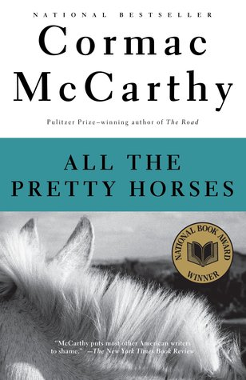

# "All the Pretty Horses (The Border Trilogy, #1)"

By Cormac McCarthy

## Book data

[GoodReads ID/URL](https://www.goodreads.com/book/show/469571)

- ISBN: 0679744398
- ISBN13: 9780679744399
- Rating: 5
- Average Rating: 4.01
- Published: 1992
- Publisher: Vintage
- Binding: Paperback
- Shelves: fiction, literature, novels
- Shelf: read
- Pages: 302

## See also

- ["Blood Meridian, or the Evening Redness in the West"](Blood_Meridian__or_the_Evening_Redness_in_the_West.md)
- [Child of God](Child_of_God.md)
- ["Cities of the Plain (The Border Trilogy, #3)"](Cities_of_the_Plain_The_Border_Trilogy__3.md)
- [Outer Dark](Outer_Dark.md)
- ["The Crossing (The Border Trilogy, #2)"](The_Crossing_The_Border_Trilogy__2.md)
