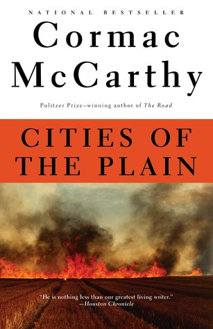

# "Cities of the Plain (The Border Trilogy, #3)"

By Cormac McCarthy

## Book data

[GoodReads ID/URL](https://www.goodreads.com/book/show/40470)

- ISBN: 0679747192
- ISBN13: 9780679747192
- Rating: 5
- Average Rating: 4.11
- Published: 1998
- Publisher: Vintage Books
- Binding: Paperback
- Shelves: fiction, literature
- Shelf: read
- Pages: 292

## Review

Everytime I finish a Cormac McCarthy novel I ask myself why haven't I read all of his works ? Clearly he is the greatest of our living writers.

## See also

- ["All the Pretty Horses (The Border Trilogy, #1)"](All_the_Pretty_Horses_The_Border_Trilogy__1.md)
- ["Blood Meridian, or the Evening Redness in the West"](Blood_Meridian__or_the_Evening_Redness_in_the_West.md)
- [Child of God](Child_of_God.md)
- [Outer Dark](Outer_Dark.md)
- ["The Crossing (The Border Trilogy, #2)"](The_Crossing_The_Border_Trilogy__2.md)
