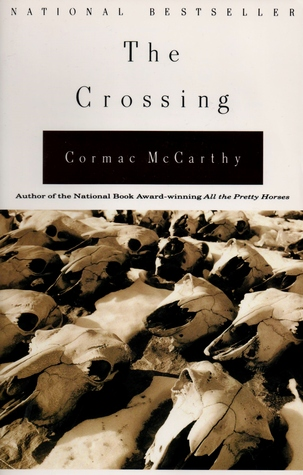

# "The Crossing (The Border Trilogy, #2)"

By Cormac McCarthy

## Book data

[GoodReads ID/URL](https://www.goodreads.com/book/show/744388)

- ISBN: 0679760849
- ISBN13: 9780679760849
- Rating: 5
- Average Rating: 4.14
- Published: 1994
- Publisher: Vintage Books
- Binding: Paperback
- Shelves: novels, literature, fiction
- Shelf: read
- Pages: 426

## See also

- ["All the Pretty Horses (The Border Trilogy, #1)"](All_the_Pretty_Horses_The_Border_Trilogy__1.md)
- ["Blood Meridian, or the Evening Redness in the West"](Blood_Meridian__or_the_Evening_Redness_in_the_West.md)
- [Child of God](Child_of_God.md)
- ["Cities of the Plain (The Border Trilogy, #3)"](Cities_of_the_Plain_The_Border_Trilogy__3.md)
- [Outer Dark](Outer_Dark.md)
