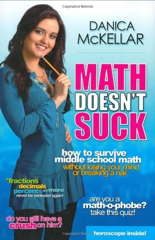

# Math Doesn't Suck: How to Survive Middle-School Math Without Losing Your Mind or Breaking a Nail

By Danica McKellar

## Book data

[GoodReads ID/URL](https://www.goodreads.com/book/show/1271823)

- ISBN: 1594630399
- ISBN13: 9781594630392
- Rating: 5
- Average Rating: 4.17
- Published: 2007
- Publisher: Avery
- Binding: Hardcover
- Shelves: 
- Shelf: read
- Pages: 320

