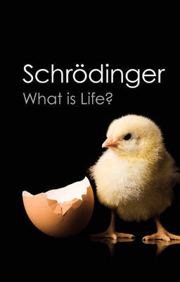

# What Is Life?: With Mind and Matter and Autobiographical Sketches

By Erwin Schrödinger

## Book data

[GoodReads ID/URL](https://www.goodreads.com/book/show/13832134)

- ISBN: 1107604664
- ISBN13: 9781107604667
- Rating: 5
- Average Rating: 4.14
- Published: 1944
- Publisher: Cambridge University Press
- Binding: Paperback
- Shelves: 
- Shelf: read
- Pages: 184

