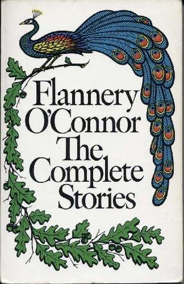

# The Complete Stories

By Flannery O'Connor

## Book data

[GoodReads ID/URL](https://www.goodreads.com/book/show/284996)

- ISBN: 
- ISBN13: 
- Rating: 5
- Average Rating: 4.39
- Published: 1971
- Publisher: Farrar, Straus & Giroux
- Binding: Paperback
- Shelves: literature, short-stories, fiction
- Shelf: read
- Pages: 555

## Review

Is Flannery O'Connor the greatest short story writer of our time ? Perhaps. Anyway, I love her. What a great read this collection is, including her letters. How does she manage to be so dark and so funn ? Love her stories about her peacocks. I wonder what the Mark Twain re-writers will do when they discover O'Connor's use of the N-word ?

## See also

- [Collected Works](Collected_Works-_Wise_Blood_-_A_Good_Man_Is_Hard_to_Find_-_The_Violent_Bear_It_Away_-_Everything_That_Rises_Must_Converge_-_Essays_and_Letters.md)
