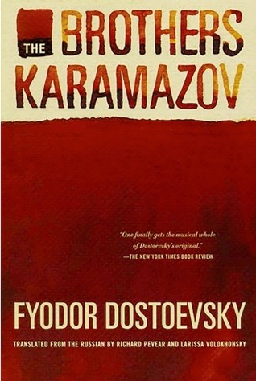

# The Brothers Karamazov

By Fyodor Dostoevsky

## Book data

[GoodReads ID/URL](https://www.goodreads.com/book/show/4934)

- ISBN: 
- ISBN13: 
- Rating: 5
- Average Rating: 4.35
- Published: 1879
- Publisher: Farrar, Straus and Giroux
- Binding: Paperback
- Shelves: literature, novels, fiction
- Shelf: read
- Pages: 796

## See also

- [Crime and Punishment](Crime_and_Punishment.md)
- [The Idiot](The_Idiot.md)
