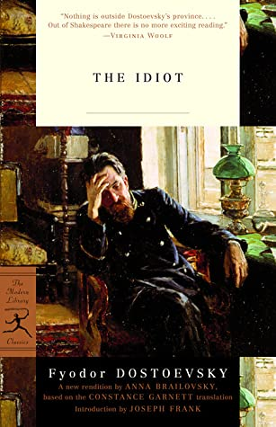

# The Idiot

By Fyodor Dostoevsky

## Book data

[GoodReads ID/URL](https://www.goodreads.com/book/show/12505)

- ISBN: 0679642420
- ISBN13: 9780679642428
- Rating: 5
- Average Rating: 4.20
- Published: 1869
- Publisher: Modern Library
- Binding: Paperback
- Shelves: literature, novels, fiction
- Shelf: read
- Pages: 667

## See also

- [Crime and Punishment](Crime_and_Punishment.md)
- [The Brothers Karamazov](The_Brothers_Karamazov.md)
