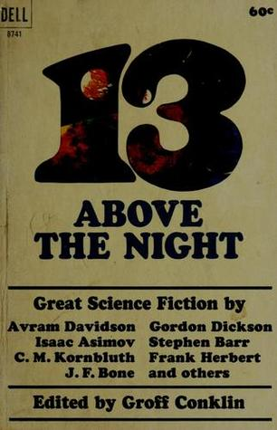

# 13 Above the Night

By Groff Conklin

## Book data

[GoodReads ID/URL](https://www.goodreads.com/book/show/869082)

- ISBN: 1400087414
- ISBN13: 9781400087419
- Rating: 5
- Average Rating: 3.61
- Published: 1965
- Publisher: Dell Publishing Co.
- Binding: Mass Market Paperback
- Shelves: science-fiction, short-stories, anthologies, conklin
- Shelf: read
- Pages: 286

## See also

- [12 Great Classics of Science Fiction](12_Great_Classics_of_Science_Fiction.md)
- [13 Great Stories of Science Fiction](13_Great_Stories_of_Science_Fiction.md)
- [A Treasury of Science Fiction](A_Treasury_of_Science_Fiction.md)
- [Big Book of Science Fiction](Big_Book_of_Science_Fiction.md)
- [Great Science Fiction by Scientists](Great_Science_Fiction_by_Scientists.md)
- [Omnibus of Science Fiction](Omnibus_of_Science_Fiction.md)
- [Possible Worlds of Science Fiction](Possible_Worlds_of_Science_Fiction.md)
- [Seven Come Infinity](Seven_Come_Infinity.md)
- [Six Great Short Science Fiction Novels](Six_Great_Short_Science_Fiction_Novels.md)
- [The Big Book of Science Fiction](The_Big_Book_of_Science_Fiction.md)
