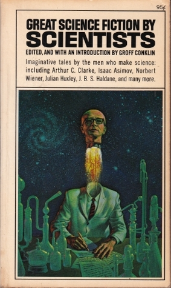

# Great Science Fiction by Scientists

By Groff Conklin

## Book data

[GoodReads ID/URL](https://www.goodreads.com/book/show/1179648)

- ISBN: 0020190301
- ISBN13: 9780020190301
- Rating: 5
- Average Rating: 3.50
- Published: 1962
- Publisher: Collier
- Binding: Paperback
- Shelves: anthologies, science-fiction, short-stories
- Shelf: read
- Pages: 313

## See also

- [12 Great Classics of Science Fiction](12_Great_Classics_of_Science_Fiction.md)
- [13 Above the Night](13_Above_the_Night.md)
- [13 Great Stories of Science Fiction](13_Great_Stories_of_Science_Fiction.md)
- [A Treasury of Science Fiction](A_Treasury_of_Science_Fiction.md)
- [Big Book of Science Fiction](Big_Book_of_Science_Fiction.md)
- [Omnibus of Science Fiction](Omnibus_of_Science_Fiction.md)
- [Possible Worlds of Science Fiction](Possible_Worlds_of_Science_Fiction.md)
- [Seven Come Infinity](Seven_Come_Infinity.md)
- [Six Great Short Science Fiction Novels](Six_Great_Short_Science_Fiction_Novels.md)
- [The Big Book of Science Fiction](The_Big_Book_of_Science_Fiction.md)
