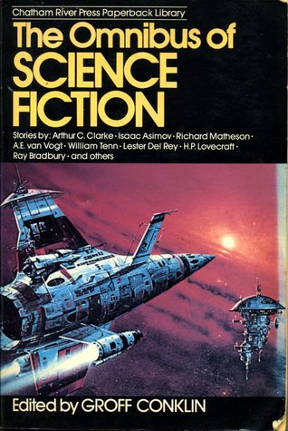

# Omnibus of Science Fiction

By Groff Conklin

## Book data

[GoodReads ID/URL](https://www.goodreads.com/book/show/2318155)

- ISBN: 0517453703
- ISBN13: 9780517453704
- Rating: 5
- Average Rating: 3.94
- Published: 1952
- Publisher: Chatham River Press
- Binding: Paperback
- Shelves: science-fiction, short-stories, anthologies, conklin
- Shelf: read
- Pages: 561

## See also

- [12 Great Classics of Science Fiction](12_Great_Classics_of_Science_Fiction.md)
- [13 Above the Night](13_Above_the_Night.md)
- [13 Great Stories of Science Fiction](13_Great_Stories_of_Science_Fiction.md)
- [A Treasury of Science Fiction](A_Treasury_of_Science_Fiction.md)
- [Big Book of Science Fiction](Big_Book_of_Science_Fiction.md)
- [Great Science Fiction by Scientists](Great_Science_Fiction_by_Scientists.md)
- [Possible Worlds of Science Fiction](Possible_Worlds_of_Science_Fiction.md)
- [Seven Come Infinity](Seven_Come_Infinity.md)
- [Six Great Short Science Fiction Novels](Six_Great_Short_Science_Fiction_Novels.md)
- [The Big Book of Science Fiction](The_Big_Book_of_Science_Fiction.md)
