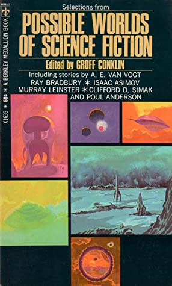

# Possible Worlds of Science Fiction

By Groff Conklin

## Book data

[GoodReads ID/URL](https://www.goodreads.com/book/show/6218049)

- ISBN: 
- ISBN13: 
- Rating: 5
- Average Rating: 3.72
- Published: 1951
- Publisher: Berkley Medallion
- Binding: Mass Market Paperback
- Shelves: science-fiction, short-stories, anthologies, conklin
- Shelf: read
- Pages: 188

## See also

- [12 Great Classics of Science Fiction](12_Great_Classics_of_Science_Fiction.md)
- [13 Above the Night](13_Above_the_Night.md)
- [13 Great Stories of Science Fiction](13_Great_Stories_of_Science_Fiction.md)
- [A Treasury of Science Fiction](A_Treasury_of_Science_Fiction.md)
- [Big Book of Science Fiction](Big_Book_of_Science_Fiction.md)
- [Great Science Fiction by Scientists](Great_Science_Fiction_by_Scientists.md)
- [Omnibus of Science Fiction](Omnibus_of_Science_Fiction.md)
- [Seven Come Infinity](Seven_Come_Infinity.md)
- [Six Great Short Science Fiction Novels](Six_Great_Short_Science_Fiction_Novels.md)
- [The Big Book of Science Fiction](The_Big_Book_of_Science_Fiction.md)
