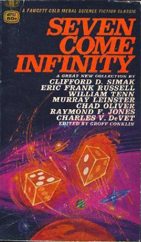

# Seven Come Infinity

By Groff Conklin

## Book data

[GoodReads ID/URL](https://www.goodreads.com/book/show/2393511)

- ISBN: 4049017520
- ISBN13: 9784049017526
- Rating: 5
- Average Rating: 3.81
- Published: 1966
- Publisher: Fawcett Publications
- Binding: Paperback
- Shelves: anthologies, science-fiction, short-stories, conklin
- Shelf: read
- Pages: 288

## See also

- [12 Great Classics of Science Fiction](12_Great_Classics_of_Science_Fiction.md)
- [13 Above the Night](13_Above_the_Night.md)
- [13 Great Stories of Science Fiction](13_Great_Stories_of_Science_Fiction.md)
- [A Treasury of Science Fiction](A_Treasury_of_Science_Fiction.md)
- [Big Book of Science Fiction](Big_Book_of_Science_Fiction.md)
- [Great Science Fiction by Scientists](Great_Science_Fiction_by_Scientists.md)
- [Omnibus of Science Fiction](Omnibus_of_Science_Fiction.md)
- [Possible Worlds of Science Fiction](Possible_Worlds_of_Science_Fiction.md)
- [Six Great Short Science Fiction Novels](Six_Great_Short_Science_Fiction_Novels.md)
- [The Big Book of Science Fiction](The_Big_Book_of_Science_Fiction.md)
