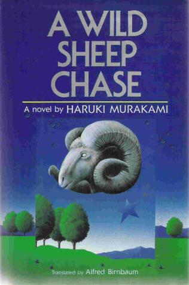

# A Wild Sheep Chase

By Haruki Murakami

## Book data

[GoodReads ID/URL](https://www.goodreads.com/book/show/46134)

- ISBN: 0008701190
- ISBN13: 
- Rating: 5
- Average Rating: 3.94
- Published: 1982
- Publisher: Kodansha International/USA Ltd.
- Binding: Hardcover
- Shelves: murakami
- Shelf: read
- Pages: 299

## See also

- [After Dark](After_Dark.md)
- ["Blind Willow, Sleeping Woman"](Blind_Willow__Sleeping_Woman.md)
- [Colorless Tsukuru Tazaki and His Years of Pilgrimage](Colorless_Tsukuru_Tazaki_and_His_Years_of_Pilgrimage.md)
- [Dance Dance Dance](Dance_Dance_Dance.md)
- [Hard-Boiled Wonderland and the End of the World](Hard-Boiled_Wonderland_and_the_End_of_the_World.md)
- [Kafka on the Shore](Kafka_on_the_Shore.md)
- [The Wind-Up Bird Chronicle](The_Wind-Up_Bird_Chronicle.md)
