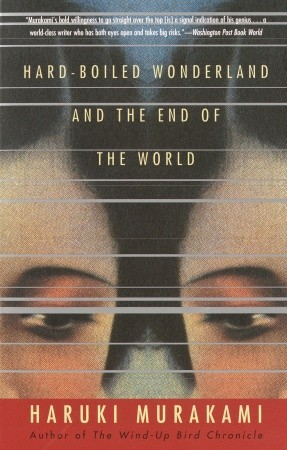

# Hard-Boiled Wonderland and the End of the World

By Haruki Murakami

## Book data

[GoodReads ID/URL](https://www.goodreads.com/book/show/106484)

- ISBN: 
- ISBN13: 
- Rating: 5
- Average Rating: 4.14
- Published: 1985
- Publisher: Vintage
- Binding: Paperback
- Shelves: literature, science-fiction, fiction, novels, murakami
- Shelf: read
- Pages: 400

## Review

I really loved this novel. Sort of a hybrid between a hard-bitten detective novel by Raymond Chandler and a surreal fantasy world of Richard Brautigan. I wonder if Murakami was influenced by Brautigan who, later in his career, became famous in Japan and even moved there for a while.  This book was such a pleasure to read. I'm sad I've finished it. However, I have plenty more of Murakami to read.

## See also

- [After Dark](After_Dark.md)
- [A Wild Sheep Chase](A_Wild_Sheep_Chase.md)
- ["Blind Willow, Sleeping Woman"](Blind_Willow__Sleeping_Woman.md)
- [Colorless Tsukuru Tazaki and His Years of Pilgrimage](Colorless_Tsukuru_Tazaki_and_His_Years_of_Pilgrimage.md)
- [Dance Dance Dance](Dance_Dance_Dance.md)
- [Kafka on the Shore](Kafka_on_the_Shore.md)
- [The Wind-Up Bird Chronicle](The_Wind-Up_Bird_Chronicle.md)
