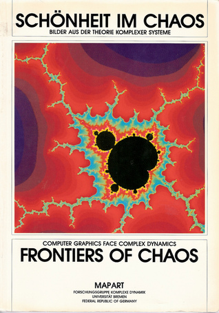

# Frontiers of Chaos

By Heinz-Otto Peitgen

## Book data

[GoodReads ID/URL](https://www.goodreads.com/book/show/6549735)

- ISBN: 3920699653
- ISBN13: 
- Rating: 5
- Average Rating: 5.00
- Published: 1985
- Publisher: MAP ART
- Binding: Paperback
- Shelves: mathematics
- Shelf: read
- Pages: 108

