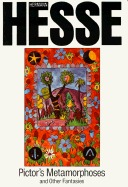

# Pictor's Metamorphoses and Other Fantasies

By Hermann Hesse

## Book data

[GoodReads ID/URL](https://www.goodreads.com/book/show/13515)

- ISBN: 
- ISBN13: 
- Rating: 5
- Average Rating: 3.81
- Published: 1922
- Publisher: St. Martins Press-3pl
- Binding: Paperback
- Shelves: literature, short-stories, fiction
- Shelf: read
- Pages: 213

## See also

- [Beneath the Wheel](Beneath_the_Wheel.md)
- [Demian](Demian-_Die_Geschichte_von_Emil_Sinclairs_Jugend.md)
- [Narcissus and Goldmund](Narcissus_and_Goldmund.md)
- [Peter Camenzind](Peter_Camenzind.md)
- [Siddhartha](Siddhartha.md)
- [Steppenwolf](Steppenwolf.md)
- [Stories of Five Decades](Stories_of_Five_Decades.md)
- [The Fairy Tales of Hermann Hesse](The_Fairy_Tales_of_Hermann_Hesse.md)
- [The Glass Bead Game](The_Glass_Bead_Game.md)
- [The Journey to the East](The_Journey_to_the_East.md)
