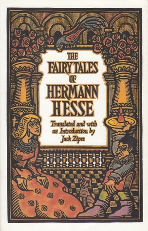

# The Fairy Tales of Hermann Hesse

By Hermann Hesse

## Book data

[GoodReads ID/URL](https://www.goodreads.com/book/show/13514)

- ISBN: 0553377760
- ISBN13: 9780553377767
- Rating: 5
- Average Rating: 3.99
- Published: 1919
- Publisher: Bantam Books
- Binding: Paperback
- Shelves: literature, short-stories, fiction
- Shelf: read
- Pages: 266

## See also

- [Beneath the Wheel](Beneath_the_Wheel.md)
- [Demian](Demian-_Die_Geschichte_von_Emil_Sinclairs_Jugend.md)
- [Narcissus and Goldmund](Narcissus_and_Goldmund.md)
- [Peter Camenzind](Peter_Camenzind.md)
- [Pictor's Metamorphoses and Other Fantasies](Pictors_Metamorphoses_and_Other_Fantasies.md)
- [Siddhartha](Siddhartha.md)
- [Steppenwolf](Steppenwolf.md)
- [Stories of Five Decades](Stories_of_Five_Decades.md)
- [The Glass Bead Game](The_Glass_Bead_Game.md)
- [The Journey to the East](The_Journey_to_the_East.md)
