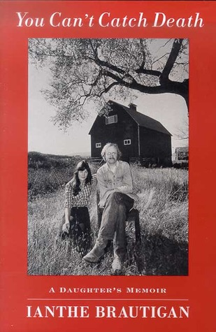

# You Can't Catch Death: A Daughter's Memoir

By Ianthe Brautigan

## Book data

[GoodReads ID/URL](https://www.goodreads.com/book/show/851879)

- ISBN: 031225296X
- ISBN13: 9780312252960
- Rating: 4
- Average Rating: 3.97
- Published: 2000
- Publisher: St. Martin's Press
- Binding: Hardcover
- Shelves: brautigan, biography
- Shelf: read
- Pages: 192

