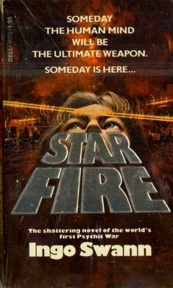

# Star Fire

By Ingo Swann

## Book data

[GoodReads ID/URL](https://www.goodreads.com/book/show/687730)

- ISBN: 0722183038
- ISBN13: 9780722183038
- Rating: 5
- Average Rating: 3.89
- Published: 1978
- Publisher: Sphere
- Binding: Paperback
- Shelves: science-fiction
- Shelf: read
- Pages: 314

## Review

From the author bio at the end of the book:  INGO SWANN is America's most researched super-psychic, a fine artist, and a gifted writer. His credentials are unique - he is "a cosmic psychonaut who probably has a better grasp of parapsychology than most professional researchers" ... a "sensitive" who has caused temperature changes in remote targets by pure force of will, and who used out-of-body astral projection to correctly predict the major scientific surprise of the Mariner 10 Mercury probe! His powers have been irrefutably demonstrated at the prestigious Stanford Research Institute.  Read more about Swann in the Wikipedia article at https://en.wikipedia.org/wiki/Ingo_Swann

