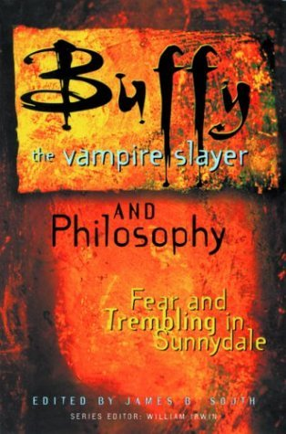

# Buffy the Vampire Slayer and Philosophy: Fear and Trembling in Sunnydale

By James B. South

## Book data

[GoodReads ID/URL](https://www.goodreads.com/book/show/31912)

- ISBN: 0812695313
- ISBN13: 9780812695311
- Rating: 5
- Average Rating: 4.06
- Published: 2003
- Publisher: Open Court
- Binding: Paperback
- Shelves: philosophy, anthologies
- Shelf: read
- Pages: 335

