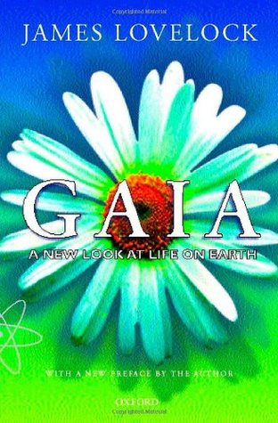

# Gaia: A New Look at Life on Earth

By James E. Lovelock

## Book data

[GoodReads ID/URL](https://www.goodreads.com/book/show/274230)

- ISBN: 0192862189
- ISBN13: 9780192862181
- Rating: 5
- Average Rating: 3.83
- Published: 1979
- Publisher: Oxford University Press, USA
- Binding: Paperback
- Shelves: philosophy, science
- Shelf: read
- Pages: 176

## See also

- [The Ages of Gaia](The_Ages_of_Gaia-_A_Biography_of_Our_Living_Earth.md)
