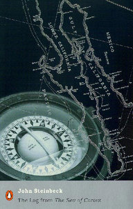

# The Log from the Sea of Cortez

By John Steinbeck

## Book data

[GoodReads ID/URL](https://www.goodreads.com/book/show/4803)

- ISBN: 0141186070
- ISBN13: 9780141186078
- Rating: 4
- Average Rating: 3.84
- Published: 1951
- Publisher: Penguin Books Ltd
- Binding: Paperback
- Shelves: essays, steinbeck
- Shelf: read
- Pages: 288

## See also

- ["Cannery Row (Cannery Row, #1)"](Cannery_Row_Cannery_Row__1.md)
- [East of Eden](East_of_Eden.md)
- [In Dubious Battle](In_Dubious_Battle.md)
- [Of Mice and Men](Of_Mice_and_Men.md)
- ["Sweet Thursday (Cannery Row, #2)"](Sweet_Thursday_Cannery_Row__2.md)
- [The Chrysanthemums and Other Stories](The_Chrysanthemums_and_Other_Stories.md)
- [The Grapes of Wrath](The_Grapes_of_Wrath.md)
- [The Moon Is Down](The_Moon_Is_Down.md)
- [The Pastures of Heaven](The_Pastures_of_Heaven.md)
- [The Pearl](The_Pearl.md)
- [The Red Pony](The_Red_Pony.md)
- [The Wayward Bus](The_Wayward_Bus.md)
- [The Winter of Our Discontent](The_Winter_of_Our_Discontent.md)
- [To a God Unknown](To_a_God_Unknown.md)
- [Tortilla Flat](Tortilla_Flat.md)
