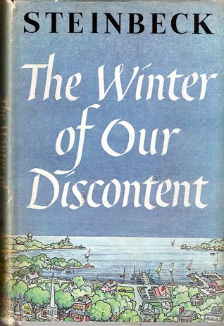

# The Winter of Our Discontent

By John Steinbeck

## Book data

[GoodReads ID/URL](https://www.goodreads.com/book/show/2090460)

- ISBN: 
- ISBN13: 
- Rating: 5
- Average Rating: 4.00
- Published: 1961
- Publisher: The Viking Press
- Binding: Hardback
- Shelves: literature, novels, steinbeck, fiction
- Shelf: read
- Pages: 281

## See also

- ["Cannery Row (Cannery Row, #1)"](Cannery_Row_Cannery_Row__1.md)
- [East of Eden](East_of_Eden.md)
- [In Dubious Battle](In_Dubious_Battle.md)
- [Of Mice and Men](Of_Mice_and_Men.md)
- ["Sweet Thursday (Cannery Row, #2)"](Sweet_Thursday_Cannery_Row__2.md)
- [The Chrysanthemums and Other Stories](The_Chrysanthemums_and_Other_Stories.md)
- [The Grapes of Wrath](The_Grapes_of_Wrath.md)
- [The Log from the Sea of Cortez](The_Log_from_the_Sea_of_Cortez.md)
- [The Moon Is Down](The_Moon_Is_Down.md)
- [The Pastures of Heaven](The_Pastures_of_Heaven.md)
- [The Pearl](The_Pearl.md)
- [The Red Pony](The_Red_Pony.md)
- [The Wayward Bus](The_Wayward_Bus.md)
- [To a God Unknown](To_a_God_Unknown.md)
- [Tortilla Flat](Tortilla_Flat.md)
