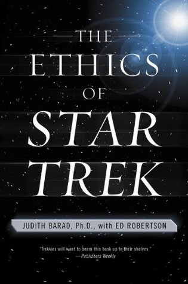

# The Ethics of Star Trek

By Judith A. Barad

## Book data

[GoodReads ID/URL](https://www.goodreads.com/book/show/422906)

- ISBN: 0060933267
- ISBN13: 9780060933265
- Rating: 5
- Average Rating: 3.96
- Published: 2000
- Publisher: Harper Perennial
- Binding: Paperback
- Shelves: philosophy, anthologies
- Shelf: read
- Pages: 384

