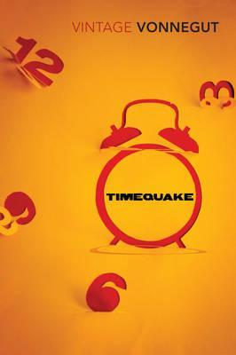

# Timequake

By Kurt Vonnegut Jr.

## Book data

[GoodReads ID/URL](https://www.goodreads.com/book/show/9594)

- ISBN: 0099267543
- ISBN13: 9780099267546
- Rating: 4
- Average Rating: 3.72
- Published: 1997
- Publisher: Vintage Classics
- Binding: Paperback
- Shelves: science-fiction, novels, vonnegut
- Shelf: read
- Pages: 219

## See also

- [A Man Without a Country](A_Man_Without_a_Country.md)
- [Armageddon in Retrospect](Armageddon_in_Retrospect-_And_Other_New_and_Unpublished_Writings_on_War_and_Peace.md)
- [Bagombo Snuff Box](Bagombo_Snuff_Box.md)
- [Bluebeard](Bluebeard.md)
- [Breakfast of Champions](Breakfast_of_Champions.md)
- [Cat's Cradle](Cats_Cradle.md)
- [Deadeye Dick](Deadeye_Dick.md)
- [Galápagos](Galápagos.md)
- ["God Bless You, Mr. Rosewater"](God_Bless_You__Mr_Rosewater.md)
- ["Happy Birthday, Wanda June"](Happy_Birthday__Wanda_June.md)
- [Hocus Pocus](Hocus_Pocus.md)
- [Jailbird](Jailbird.md)
- [Mother Night](Mother_Night.md)
- [Player Piano](Player_Piano.md)
- ["Slapstick, or Lonesome No More!"](Slapstick__or_Lonesome_No_More!.md)
- [Slaughterhouse-Five](Slaughterhouse-Five.md)
- [The Sirens of Titan](The_Sirens_of_Titan.md)
- [Welcome to the Monkey House](Welcome_to_the_Monkey_House.md)
