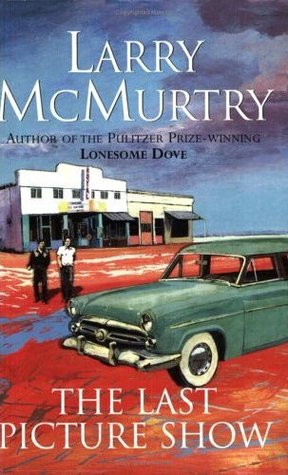

# The Last Picture Show

By Larry McMurtry

## Book data

[GoodReads ID/URL](https://www.goodreads.com/book/show/50051)

- ISBN: 0752837214
- ISBN13: 9780752837215
- Rating: 5
- Average Rating: 3.99
- Published: 1966
- Publisher: Orion Books
- Binding: Mass Market Paperback
- Shelves: literature, novels, mcmurtry, fiction
- Shelf: read
- Pages: 280

## See also

- [All My Friends Are Going to Be Strangers](All_My_Friends_Are_Going_to_Be_Strangers.md)
- [Cadillac Jack](Cadillac_Jack.md)
- [Duane's Depressed](Duanes_Depressed.md)
- [Film Flam](Film_Flam-_Essays_on_Hollywood.md)
- ["Horseman, Pass By"](Horseman__Pass_By.md)
- [In a Narrow Grave](In_a_Narrow_Grave-_Essays_on_Texas.md)
- [Leaving Cheyenne](Leaving_Cheyenne.md)
- [Lonesome Dove](Lonesome_Dove.md)
- [Moving On](Moving_On.md)
- [Somebody's Darling](Somebodys_Darling.md)
- [Some Can Whistle](Some_Can_Whistle.md)
- [Terms of Endearment](Terms_of_Endearment.md)
- [Texasville](Texasville.md)
- [The Desert Rose](The_Desert_Rose.md)
- [The Evening Star](The_Evening_Star.md)
