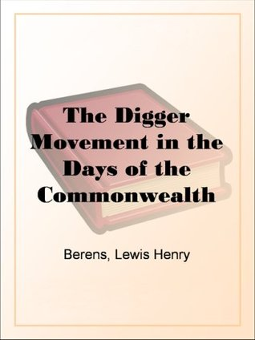

# "The Digger Movement in the Days of the Commonwealth As Revealed in the Writings of Gerrard Winstanley, the Digger, Mystic and Rationalist, Communist and Social Reformer"

By Lewis Henry Berens

## Book data

[GoodReads ID/URL](https://www.goodreads.com/book/show/22393419)

- ISBN: 
- ISBN13: 
- Rating: 5
- Average Rating: 4.09
- Published: 1961
- Publisher: Public Domain Books
- Binding: Kindle Edition
- Shelves: 
- Shelf: read
- Pages: 280

