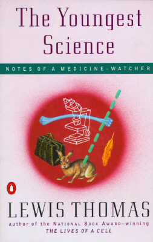

# The Youngest Science

By Lewis Thomas

## Book data

[GoodReads ID/URL](https://www.goodreads.com/book/show/434412)

- ISBN: 0001402432
- ISBN13: 
- Rating: 5
- Average Rating: 4.13
- Published: 1983
- Publisher: Penguin Books
- Binding: 
- Shelves: science
- Shelf: read
- Pages: ""

## See also

- [The Lives of a Cell](The_Lives_of_a_Cell-_Notes_of_a_Biology_Watcher.md)
