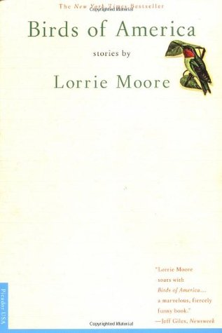

# Birds of America: Stories

By Lorrie Moore

## Book data

[GoodReads ID/URL](https://www.goodreads.com/book/show/19631)

- ISBN: 0312241224
- ISBN13: 9780312241223
- Rating: 5
- Average Rating: 4.10
- Published: 1998
- Publisher: Picador USA
- Binding: Paperback
- Shelves: literature, short-stories, fiction
- Shelf: read
- Pages: 291

## See also

- [Bark](Bark.md)
- [Self-Help](Self-Help.md)
