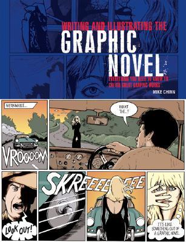

# Writing and Illustrating the Graphic Novel: Everything You Need to Know to Create Great Graphic Works

By Mike Chinn

## Book data

[GoodReads ID/URL](https://www.goodreads.com/book/show/160446)

- ISBN: 0764127888
- ISBN13: 9780764127885
- Rating: 4
- Average Rating: 3.32
- Published: 2004
- Publisher: B.E.S. Publishing
- Binding: Paperback
- Shelves: 
- Shelf: read
- Pages: 128

