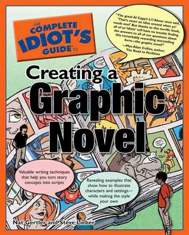

# The Complete Idiot's Guide to Creating a Graphic Novel

By Nat Gertler

## Book data

[GoodReads ID/URL](https://www.goodreads.com/book/show/151533)

- ISBN: 1592572332
- ISBN13: 9781592572335
- Rating: 4
- Average Rating: 3.79
- Published: 2004
- Publisher: Alpha
- Binding: Paperback
- Shelves: 
- Shelf: read
- Pages: 352

