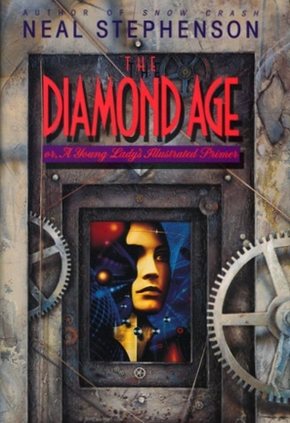

# "The Diamond Age: or, A Young Lady's Illustrated Primer"

By Neal Stephenson

## Book data

[GoodReads ID/URL](https://www.goodreads.com/book/show/1056946)

- ISBN: 0553096095
- ISBN13: 9780553096095
- Rating: 5
- Average Rating: 4.16
- Published: 1995
- Publisher: Bantam Spectra
- Binding: Hardcover
- Shelves: science-fiction
- Shelf: read
- Pages: 455

## Review

Perhaps his best book? Better than [b:Snow Crash|40651883|Snow Crash|Neal Stephenson|https://i.gr-assets.com/images/S/compressed.photo.goodreads.com/books/1530057753l/40651883._SX50_.jpg|493634]? Maybe. I love the way he uses [a:Philip K. Dick|4764|Philip K. Dick|https://images.gr-assets.com/authors/1264613853p2/4764.jpg] like future slang in this book. The stories from the illustrated primer are great. Nell is an absolutely absorbing character in a coming of age tale. Molecular nanotechnology is omnipresent in the novel's world, with Stephenson extrapolating nanotechnology use and implementation in a variety of astounding ways including the integration of nanotechnology with artificial intelligence. The book deals with issues of social class, ethnicity, the effect of stories and education on the development of human personality, and the nature of artificial intelligence. Many of the technological advances are speculative but many are reasonable extrapolations of existing technology such as smart paper.  If you are a little confused by all the nanotech in this novel then a good introduction to nanotechnology can be found in the book [b:Engines of Creation: The Coming Era of Nanotechnology|83596|Engines of Creation The Coming Era of Nanotechnology|K. Eric Drexler|https://i.gr-assets.com/images/S/compressed.photo.goodreads.com/books/1320504490l/83596._SY75_.jpg|80705] by [a:K. Eric Drexler|599584|K. Eric Drexler|https://images.gr-assets.com/authors/1365796028p2/599584.jpg].  The ending is a bit rushed. Thanks Neal!

## See also

- [Cryptonomicon](Cryptonomicon.md)
- [Snow Crash](Snow_Crash.md)
- [The Big U](The_Big_U.md)
- [Zodiac](Zodiac-_The_Eco-Thriller.md)
