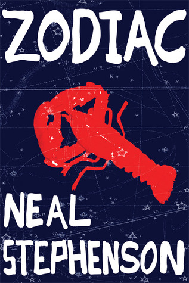

# Zodiac: The Eco-Thriller

By Neal Stephenson

## Book data

[GoodReads ID/URL](https://www.goodreads.com/book/show/142913)

- ISBN: 0802143156
- ISBN13: 9780802143150
- Rating: 5
- Average Rating: 3.73
- Published: 1988
- Publisher: Grove Press
- Binding: Paperback
- Shelves: fiction, novels
- Shelf: read
- Pages: 320

## Review

Stephenson's writing improves dramatically in this, his 2nd novel. It's remarkable the degree of improvement in writing from "The Big U" to "Zodiac". Well done!  If you are looking for an eco-thriller then I can highly recommend this at times hilarious and thoroughly enjoyable educational read.

## See also

- [Cryptonomicon](Cryptonomicon.md)
- [Snow Crash](Snow_Crash.md)
- [The Big U](The_Big_U.md)
- ["The Diamond Age](The_Diamond_Age-_or__A_Young_Ladys_Illustrated_Primer.md)
