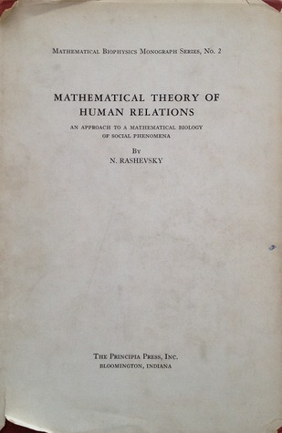

# Mathematical Theory of Human Relations

By Nicolas Rashevsky

## Book data

[GoodReads ID/URL](https://www.goodreads.com/book/show/6550673)

- ISBN: 
- ISBN13: 
- Rating: 5
- Average Rating: 3.50
- Published: 1947
- Publisher: The Principia Press
- Binding: Hardcover
- Shelves: mathematics, science
- Shelf: read
- Pages: 202

## See also

- [Mathematical Biophysics](Mathematical_Biophysics-_Physico-Mathematical_Foundations_of_Biology.md)
- [Mathematical Biophysics](Mathematical_Biophysics-_V_1.md)
