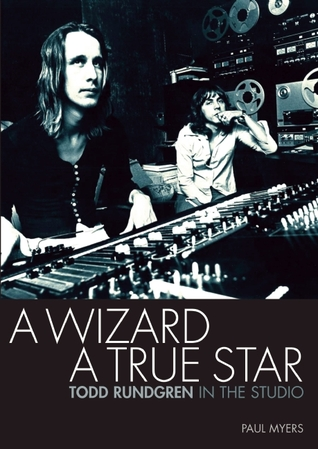

# A Wizard a True Star: Todd Rundgren in the studio

By Paul Myers

## Book data

[GoodReads ID/URL](https://www.goodreads.com/book/show/8695857)

- ISBN: 1906002339
- ISBN13: 9781906002336
- Rating: 5
- Average Rating: 4.12
- Published: 2010
- Publisher: Jawbone Press
- Binding: Paperback
- Shelves: biography, nonfiction
- Shelf: read
- Pages: 320

## Review

Really well researched details of Todd's work in the recording studio producing artists like Robbie Robertson, Patti Smith, XTC, Sparks, Hall & Oates, Meat Loaf, Cheap Trick, Grand Funk, The Psychedelic Furs, The Tubes, Todd's solo works, and his own band Utopia. Lots of great interviews with the artists and Todd himself. A really great read.

