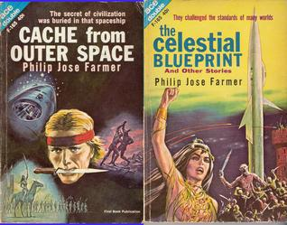

# Cache from Outer Space/Celestial Blueprint

By Philip José Farmer

## Book data

[GoodReads ID/URL](https://www.goodreads.com/book/show/6557221)

- ISBN: 
- ISBN13: 
- Rating: 0
- Average Rating: 3.06
- Published: 1962
- Publisher: Ace Books Inc
- Binding: Mass Market Paperback
- Shelves: to-read, farmer
- Shelf: to-read
- Pages: 253

## See also

- [A Barnstormer in Oz](A_Barnstormer_in_Oz.md)
- [Blown](Blown.md)
- [Dare](Dare.md)
- [Dayworld (Dayworld #1)](Dayworld_Dayworld_1.md)
- [Down in the Black Gang](Down_in_the_Black_Gang.md)
- [Flesh](Flesh.md)
- [Image of the Beast](Image_of_the_Beast.md)
- [Nothing Burns in Hell](Nothing_Burns_in_Hell.md)
- [Strange Relations](Strange_Relations.md)
- [The Day of Timestop](The_Day_of_Timestop.md)
- [The Grand Adventure](The_Grand_Adventure.md)
- [Venus on the Half-Shell](Venus_on_the_Half-Shell.md)
