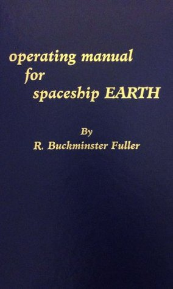

# Operating Manual for Spaceship Earth

By R. Buckminster Fuller

## Book data

[GoodReads ID/URL](https://www.goodreads.com/book/show/316362)

- ISBN: 089190235X
- ISBN13: 9780891902355
- Rating: 5
- Average Rating: 4.07
- Published: 1969
- Publisher: Amereon Limited
- Binding: Hardcover
- Shelves: philosophy, science
- Shelf: read
- Pages: 128

## See also

- [Critical Path](Critical_Path.md)
- [Synergetics](Synergetics.md)
